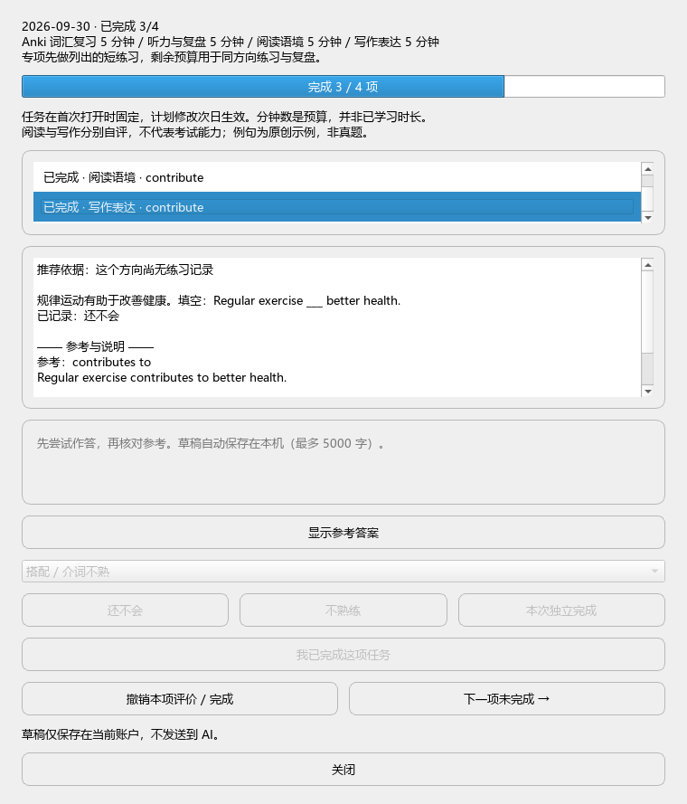

# 今日任务与双轨练习（2026-09-29）

## 实现

- 主窗口基于已经保存的计划生成每日任务；动态模式沿用同类练习反馈计划，不比较跨专项绝对得分率。
- 按日期固定预算与选词；仅生成正分钟任务，各任务预算总和与输入计划一致。没有有效计划或考试结束不新建任务。
- 阅读与写作每项选择 1～3 词（每 5 分钟一个，上下限 1～3），使用现有 12 词原创包；剩余预算提示用于同方向练习与复盘。
- 用独立的日期、方向、单词结果记录自评。还不会优先，其次未练、不熟练、独立完成；同档按较早记录优先，固定词序打破平局。只读取今天之前的记录。
- 先揭示参考才能自评；重复提交不改写首次结果；未作答可关闭后继续；跨日提交被拦截。
- 词汇按 Anki 原生顺序自行学习，听力使用自备材料，均手动确认完成。不读取复习日志，不改卡片、模板、FSRS；完成不代表掌握。
- 与已有资料共用原子存储，保留其他字段；每日记录损坏时不覆盖。草稿不保存，不发送 AI 请求。

## 验证

86 项 unittest 通过。新增覆盖预算守恒、当日快照、次日生成、双轨独立、困难优先、部分完成、重复提交、跨日拦截、非法结果、损坏文件保护及旧数据保留。

真实 Qt 离屏交互脚本 tests/verify_daily_ui.py 通过：答案揭示前评分禁用；阅读完成与写作不会分别保存；手动完成；关闭重开恢复 3/4 进度。截图经检查文字可读，任务列表与作答区均可滚动。此为隔离 Qt 验证，并非用户 Anki 窗口的完整点击验收。

## 边界

本轮完成每日任务和双轨自评首版，未实现自动选取个人到期词、语料高频统计、内容扩容、错因诊断、AI 作文反馈。现有 AI 的真实服务商联调及新版词卡实机视觉验收仍待完成。任务预算不是实际用时，结果不是考试成绩，不进入原有可比组趋势。

## 0.1.1 体验改进（2026-09-30）

- 草稿输入后 700ms 自动保存；切换、评分、关闭时也保存。按日期/方向/单词隔离，最多 5000 字，不发送 AI。保存失败时保留输入并阻止切换或关闭，提示用户处理，不默默丢弃。
- 可撤销当天当前项评价或手动完成，再次查看参考后重评；不改其他方向、其他日期及原生 Anki 复习记录。
- 增加完成进度条、下一项未完成按钮；重开自动选中首项未完成。不会自动跳题，避免重复点击误评下一题。
- 88 项测试通过；真实 Qt 检查切换草稿恢复、关闭重开、自动定位、撤销重评；新版安装包通过真实 Anki 清单与解包词库验证。截图已更新并检查，仍为隔离 Qt 验证。

以上取代首版“不保存草稿”和“首次结果不能撤销”的行为说明。

## 0.1.2 错因与复练（2026-09-30）

每日任务新增可跳过错因选择，揭示答案后可选。仅未熟练评价保存错因，独立完成清空错因；撤销评价同时清除错因、保留草稿。下一次该词在同方向入选时显示对应通用检查提示，不跨阅读/写作复制，也不发送 AI。

新增 practice_variants.py，为原 12 词各增加第二组原创阅读与写作语境：共 24 组 / 48 道练习。按该方向最近一次完成题的 variant 在 0 与 1 之间轮换；未完成不推进；旧记录缺少 variant 时按原题处理，今日快照保持不变。基础批量训练卡仍为 24 张，新增语境只用于每日任务。

89 项单元测试通过；真实 Qt 验证错因保存及旧流程回归，更新截图后检查；0.1.2 包通过 Anki 实际清单解析与词库校验。尚非真实考试语料统计，只有两组语境，不代表无限题库或自动错因诊断。
