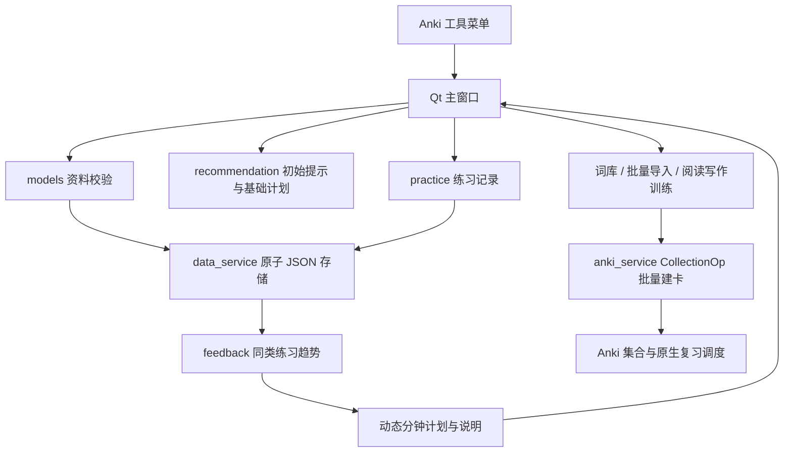

# 软件工程交付说明（MVP）

## 1. 需求与范围

面向四六级备考学生，在成熟开源项目 Anki 上进行 Python 插件二次开发。业务闭环为：输入资料 → 初始提示 → 生成计划 → Anki 卡片学习 → 录入专项练习 → 同类练习趋势 → 动态计划。核心离线，无服务器、模型训练或额外运行依赖。

| 编号 | 需求 | 实现与验收入口 |
| --- | --- | --- |
| R1 | 合法资料录入与持久保存 | models / data_service；test_profile |
| R2 | 分项成绩描述和谨慎提示 | recommendation；test_recommendation |
| R3 | 个性化且可解释的时间分配 | 均衡、用户重点、小幅初始提示、动态反馈模式 |
| R4 | 复用 Anki 卡片与调度 | anki_service；真实后端批量验证 |
| R5 | 练习历史 | practice / practice_ui；test_practice |
| R6 | 根据新练习动态调整 | feedback；test_feedback；Task 008 端到端验证 |
| R7 | 易于理解和演示 | Qt 原生窗口、README、独立模拟资料生成器 |
| R8 | 软件工程过程 | 分阶段 Git、回归测试、来源授权、异常保护、验证报告 |

原任务书中“按绝对得分率直接判断弱项”已根据用户讨论修正：初始提示需确认；动态模式只比较同类练习自身变化。AI 顾问属于 Phase 8 可选项，不是 MVP 验收条件。

## 2. 架构与模块



数据：资料和练习使用账户目录 JSON；词库为插件内只读 JSON；卡片由 Anki 集合保存。推荐逻辑为纯 Python，Qt 仅负责输入与展示。写入集合使用 Anki 原生 API 与撤销机制，不直接修改数据库表。

## 3. 原项目与新增功能对照

| 能力 | Anki 原有 | 本项目新增 |
| --- | --- | --- |
| 卡片、牌组、模板 | 提供基础系统 | 建立备考牌组和专用模板 |
| 间隔重复与 FSRS | 提供复习调度 | 不修改；调用其正常学习流程 |
| 学习资料 | 非本项目的专项资料表单 | 四级成绩、目标、时间与重点 |
| 计划 | 原生牌组复习设置 | 各专项每日分钟分配与理由 |
| 词汇资源 | 用户自行组织 | 三套带来源与授权的离线词库 |
| 专项训练 | 通用卡片能力 | 阅读语境、写作表达示例卡 |
| 反馈 | 卡片复习历史 | 手动专项练习、可比组趋势与计划调整 |

本项目没有开发 Anki 本身，没有重新实现 FSRS，也不声称卡片正确率等于考试能力。

## 4. 核心算法

初始提示与基础时间分配见 [规则文档](planning-and-storage.md)。动态规则见 [Task 008](task008-feedback.md)。所有结果确定性生成；输入分组和日期不变时结果不变。比例、28 日窗口、6 个练习日和 5 个百分点阈值均为可解释项目规则，尚未作教育效果实证校准。

## 5. 测试与异常处理

| 层级 | 检查重点 | 证据 |
| --- | --- | --- |
| 纯逻辑与存储 | 输入范围、原子保存、损坏保护、旧记录兼容 | 70 项 unittest |
| 推荐规则 | 时间守恒、重点选择、可比组隔离、数据不足与冲突 | test_recommendation / test_feedback |
| Anki 后端 | 14160 张词库卡、24 张训练卡、查重、整批撤销、渲染 | 两个 verify_*_backend.py 脚本 |
| Qt 离屏 | 练习输入、模式选择、保存回读、动态结果展示 | Task 006～008 报告及截图 |
| 早期桌面实机 | 加载、菜单、资料、单词卡正反面 | Task 001、002、005 报告 |

动态模式保存、无记录回退及自动倒计时已完成本机桌面检查，见 desktop-acceptance-20260927.md 和 Task 009；内置六级词库的桌面重复导入也已验证。新增独立演示窗口见 Task 010。离屏验证不能代替全部真实交互验收，完整串讲仍建议在独立测试账户完成。网络推送失败单独报告，不假称已同步。

## 6. 固定答辩演示

优先使用助手内的 **答辩演示（独立模拟数据）**，四种方案与依据可直接切换，无需替换个人文件。详见 [Task 010](task010-demo.md)。以下命令行方式保留给需要在独立账户演练正式保存流程的开发者。

运行：

```powershell
python examples/generate_demo.py --output .local-backups/demo-defense
```

生成器只写指定新目录，遇到同名文件拒绝覆盖；日期相对生成当天确定，避免固定旧日期落出 28 天窗口。所有记录明确为模拟数据，不作为真实效果证据。

在独立 Anki 测试账户中演示，关闭助手后将所选文件复制为该测试账户的 `cet_smart_assistant/user_data.json`，再打开助手。不要覆盖个人账户资料。

1. `student-a.json`：总分 470，用户确认听力重点，120 分钟分为 24 / 48 / 24 / 24。
2. `student-b.json`：同样总分 470，用户确认阅读重点，分为 24 / 24 / 48 / 24。差异来自确认的学习目标，不把分项率直接宣称为能力证据。
3. 选择六级词库，演示建卡和重复导入保护；选择写作表达卡，展示 contributes to 的主动填空。
4. `feedback-before.json`：模拟听力同组下降、阅读稳定，动态计划重点听力。
5. `feedback-after.json`：新增练习后听力改善、阅读下降，动态计划重点转向阅读，页面展示均值和变化依据。
6. 展示 Git 历史、测试结果与已知边界，解释二次开发范围。

## 7. 交付清单与进度

源代码、运行环境说明、安装与用法、需求说明、模块与架构图、算法规则、测试用例与报告、Git 历史、原项目功能对照、模拟演示数据生成器均已在仓库中。

原 Phase 0～6 的核心功能现已实现；Phase 7 的代码回归与交付文档已整理。本次不进入优化和新功能扩展。Phase 8 AI 顾问仍为可选未实现项。剩余交付检查是独立账户桌面人工演练及课程要求的最终格式整理，不应把原型验证表述为教育有效性验证。
