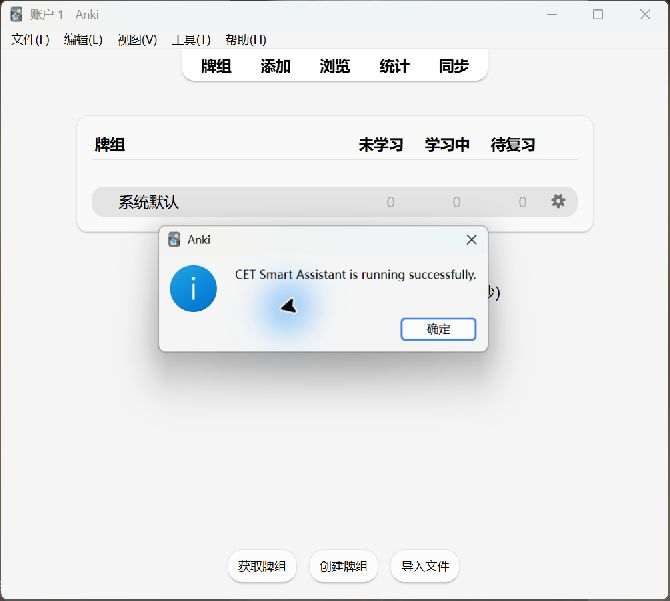

# Task 001 实机验证报告

验证日期：2026-09-24。结论：通过。

## 环境与安装

- 操作系统：Windows。
- Anki：26.9.3（安装注册信息与可执行文件版本一致）。
- Anki 程序：`E:\大二所学应用\Anki.exe`。
- 源码：`cet_smart_assistant/__init__.py`。
- 实际安装：`C:\Users\11332\AppData\Roaming\Anki2\addons21\cet_smart_assistant\__init__.py`。
- 安装方式：向原本不存在的 `cet_smart_assistant` 目录复制最小插件，重新启动 Anki 加载。
- 验证方式：操作真实 Anki Desktop 窗口，观察工具菜单与提示框，并保存截图和窗口可访问性文本。

## 用例结果

| 编号 | 操作 | 实际结果 | 状态 |
| --- | --- | --- | --- |
| T001 | 安装插件后启动 Anki | 正常进入主窗口，未出现插件加载错误提示 | 通过 |
| T002 | 打开“工具”菜单 | 出现一个“CET 智能备考助手”菜单项 | 通过 |
| T003 | 点击插件菜单 | 显示 `CET Smart Assistant is running successfully.` | 通过 |
| T004 | Anki 退出后重新启动，再次点击菜单 | 菜单仍存在，成功提示正常显示 | 通过 |
| T005 | 关闭提示，在同一会话再次点击菜单 | 再次显示相同成功提示，没有重复菜单项 | 通过 |
| T006 | 对比安装文件与源码 SHA-256 | 两者一致 | 通过 |
| T007 | 对源码执行 Python AST 语法解析 | 无语法错误 | 通过 |

安装文件与源码 SHA-256：

```text
5358BB9F0F0AE883C1F7B163F8FC38A2DBAFCB9C5E479FC542748D5639111DBC
```

## 实机证据

- [工具菜单截图](evidence/task001-menu.png)
- [首次成功提示截图](evidence/task001-first-launch.png)
- [重启后成功提示截图](evidence/task001-after-restart.png)
- [重启后窗口可访问性文本](evidence/task001-after-restart.txt)
- [同一会话重复点击截图](evidence/task001-repeat-click.png)
- [重复点击窗口可访问性文本](evidence/task001-repeat-click.txt)



## 范围与限制

本次只验收 Task 001 最小插件，不包含成绩输入、推荐算法或卡组操作。仅验证本机 Windows + Anki 26.9.3，未验证其他版本或操作系统。操作过程中遇到自动化控件定位与旧窗口连接失效，刷新当前窗口后完成验证；未因此修改插件代码。

## Git 记录

此前目录不是 Git 仓库。本次建立独立 `main` 分支仓库，按实际工作分为两次提交：最小插件与安装指南、实机验证报告与截图。没有补造此前不存在的开发历史。

查看完整记录：`git log --date=iso --format=fuller --stat`。
