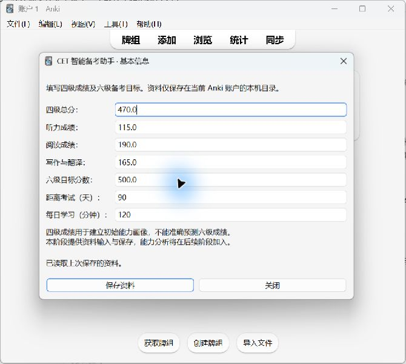

# Task 002：成绩输入与本地保存验收

日期：2026-09-24。环境：Windows、Anki Desktop 26.9.3；独立单元测试使用 Python 3.14。

## 本次变更

菜单由启动提示升级为七项资料表单。`models.py` 负责输入范围与合计差异检查；`data_service.py` 负责 JSON 读写；`ui.py` 负责原生 Qt 表单；`__init__.py` 负责菜单和当前 Anki 账户目录。未加入得分率诊断、推荐算法、卡组操作或 AI。

存储路径为当前 Anki 账户目录下的 `cet_smart_assistant/user_data.json`。不把用户资料放入插件源码目录，避免升级覆盖及账户间混用。JSON 带 `schema_version: 1`，并预留 `practice_history`；保存资料不会清除历史。

## 自动测试

命令：`python -m unittest discover -s tests -v`。

结果：6 项测试全部通过，其中无效输入测试含 12 个子用例。

| 测试 | 验证内容 | 结果 |
| --- | --- | --- |
| test_valid_boundaries | 零分、各项满分、最小天数与时长 | 通过 |
| test_invalid_inputs | 超分、负数、非法目标/时长、非整数天数、布尔值、NaN/Infinity | 通过 |
| test_mismatch_warns_but_is_valid | 分项不等于总分时只提醒 | 通过 |
| test_storage_roundtrip_and_preserve_history | 首次读取、保存回读、修改资料保留历史 | 通过 |
| test_corrupt_file_is_not_overwritten | 损坏 JSON、错误结构、未知版本和无效资料不覆盖 | 通过 |
| test_failed_replace_preserves_saved_data | 模拟替换失败后旧资料完整，临时文件清理 | 通过 |

首次在受限执行环境中测试遇到 Windows 临时目录访问问题；在正常权限环境重新运行全部通过。另通过 Python 编译检查与 `git diff --check`。

## 实机验证

1. 安装 Task 002 源码并启动 Anki：正常加载。
2. 打开菜单：显示七项输入和保存按钮，无额外依赖错误。
3. 空表单点击保存：显示“请填写有效的四级总分”，未生成资料。
4. 在 UI 输入 Student A：总分 470、听力 115、阅读 190、写作翻译 165、目标 500、90 天、每日 120 分钟。
5. 点击保存：提示“资料已保存”，读取磁盘 JSON 核对七项值一致。
6. 关闭资料窗口并退出 Anki，确认进程窗口消失；重新启动并打开插件，七项值完整回填，显示“已读取上次保存的资料”。

演示数据保留在当前账户中，方便继续演示。没有把这些数值当作用户的真实考试成绩。

实机测试覆盖正常流程和空值；其他非法输入、损坏文件与写入失败由上述独立单元测试覆盖，未逐项在 GUI 中重演。

- [空值拒绝截图](evidence/task002-empty-validation.png)
- [保存成功截图](evidence/task002-saved.png)
- [重启回填截图](evidence/task002-reloaded.png)
- [回填窗口文本](evidence/task002-reloaded.txt)

## 已知限制与下一阶段

仅验证 Windows + Anki 26.9.3；未实机切换第二个 Anki 账户。资料只在本机保存，不自动同步或备份；剩余天数需要手动更新。关闭窗口不自动保存。尚未实现能力分析，下阶段将加入标准化得分率和薄弱项识别。
