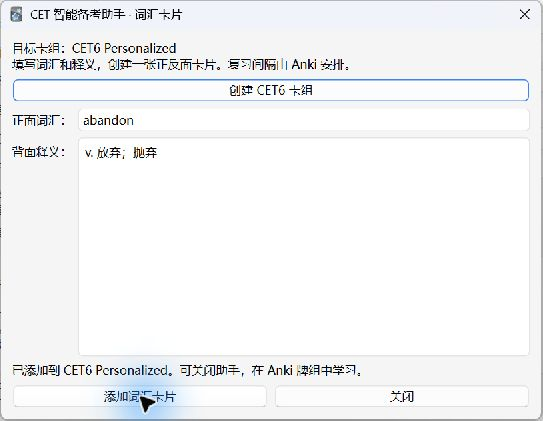
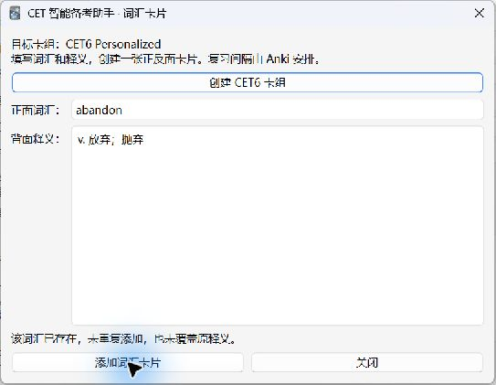
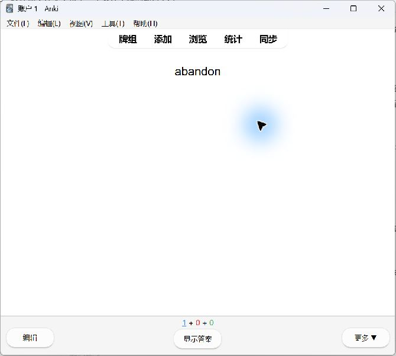
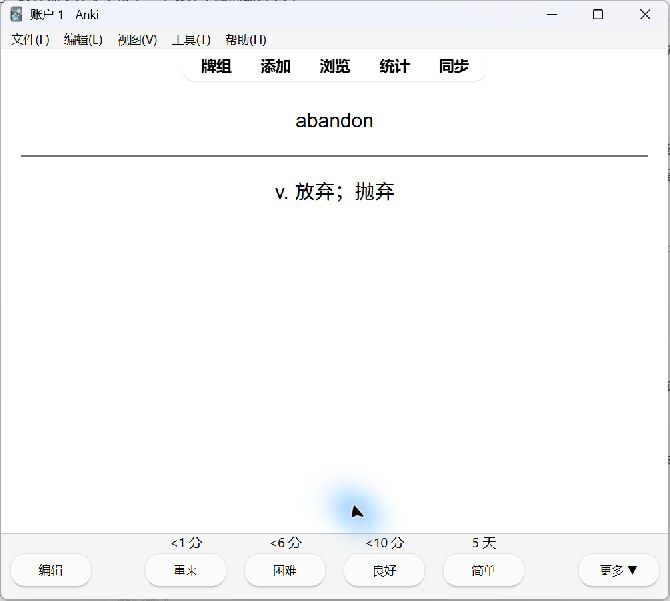
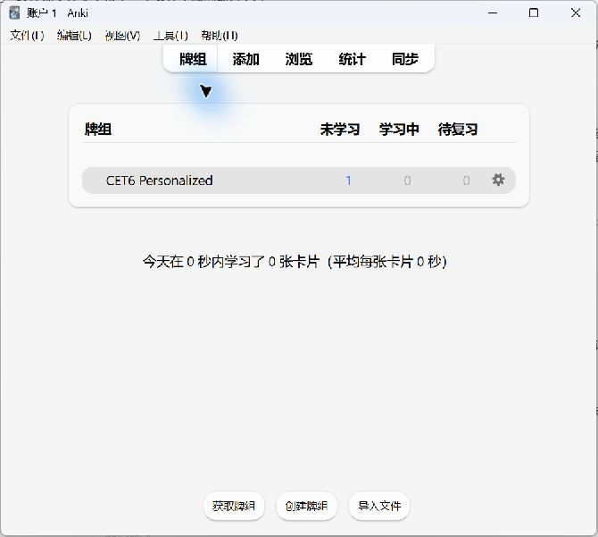

# Task 005：Anki 卡组与词汇卡片验证

验证日期：2026-09-25。环境：Windows、Anki 26.9.3。

## 实现

- 学习计划窗口新增“词汇卡片”入口，支持创建固定牌组 `CET6 Personalized`。
- 专用笔记类型包含 Front、Back 两字段和一个正反面模板。
- 表单在主线程校验并取值；集合写入通过 `CollectionOp` 执行，操作期间禁用输入和关闭，成功后刷新 Anki。
- 输入转义为纯文本，空输入及过长输入拒绝；同词查重不覆盖释义。
- 不修改 Anki 核心、FSRS 或复习参数；新增操作合并为一个撤销条目。异常途中可能留下空牌组或模板，界面说明可撤销；本次未实机验证故障注入与撤销。

## 自动验证

`python -m unittest discover -s tests -v`：33 项全部通过，其中新增 8 项使用内存集合替身验证卡组幂等、重复词、移动牌组后的查重、HTML 转义、无效输入、筛选牌组冲突、模板保护及 Unicode 规范化。既有 25 项测试回归通过。

受限沙箱执行时，资料测试遇到临时目录权限错误；普通权限运行同一命令通过。`python -m compileall -q cet_smart_assistant` 和 `git diff --check` 通过。安装目录中 7 个 Python 文件的 SHA256 与项目源码一致。

## 实机验证

| 操作 | 结果 |
| --- | --- |
| 启动 Anki 并打开助手 | 正常加载，原资料保留 |
| 点击创建牌组 | 创建成功 |
| 再次点击创建 | 提示牌组已存在 |
| 添加 abandon / v. 放弃；抛弃 | 成功创建词汇卡片 |
| 再次提交相同词汇 | 提示已存在，未重复添加、未覆盖释义 |
| 打开牌组开始学习 | 正面显示 abandon |
| 显示答案 | 正面保留，分隔线下显示中文释义 |
| 返回牌组 | 未学习 1，学习中 0，待复习 0，今日学习 0 |

未点击任何复习评分按钮。测试卡保留供继续体验。只读 SQLite 核验尝试因运行中的数据库锁失败，未写入数据库；卡片数量证据来自真实 Anki 牌组界面。







## 本机启动问题与验证方式

本机 `E:\大二所学应用\anki\Anki.exe` 与其依赖目录 `E:\大二所学应用\app`、`app_packages` 不在同一层，直接启动报 `No module named anki`，发生在插件加载之前。创建依赖目录链接被 Windows 拒绝，原安装未修复。

本次将已有运行文件和依赖复制到项目忽略目录，成功启动并使用原 Anki 账户。可运行的临时副本为：

```text
C:\Users\11332\Desktop\codex\软件工程\.local-backups\anki-runtime\Anki.exe
```

副本约 586 MB，不纳入 Git；未下载新运行包。提交的截图仅包含词汇演示和牌组，不包含个人成绩表单。全局安装目录问题与插件功能问题应分开排查。

## API 依据与范围

使用 Anki 官方 [后台操作指南](https://addon-docs.ankiweb.net/background-ops.html) 中的集合写入流程；集合和笔记操作见官方 [Collection 源码](https://github.com/ankitects/anki/blob/main/pylib/anki/collection.py)。

当前仅支持逐词手动输入；模板冲突、输入边界、移动牌组查重由单元测试覆盖，未全部在个人账户中制造冲突。下一阶段先增加专项练习记录，不直接把不同专项的绝对得分率当作可比能力。
