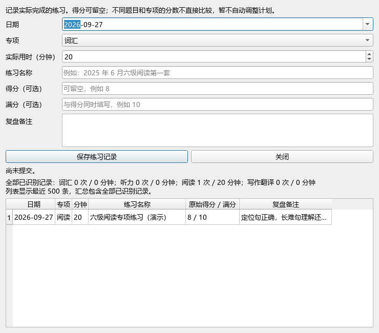

# Task 006：专项练习记录

日期：2026-09-27。

## 功能与使用

进入“工具 → CET 智能备考助手 → 练习记录”，填写日期、专项、实际用时与练习名称，得分和满分可同时留空，复盘备注可选，点击“保存练习记录”。未建立成绩资料也可记录练习。

记录支持词汇、听力、阅读、写作翻译四类；日期不得晚于今天，用时为 1～1440 整数分钟。得分须在 0 到满分之间，满分大于 0 且不超过 10000。名称最多 200 字符，备注最多 2000 字符。

保存后显示原始分数，按专项汇总练习次数和累计分钟。同一天按最近录入在前排列；列表最多展示最近 500 条，汇总覆盖全部已识别记录。不同专项、不同难度练习不计算跨项能力排名，也不自动调整学习计划。

## 存储与保护

复用当前账户的 `user_data.json` 中 `practice_history` 字段，新增记录包含独立 ID 和记录版本。不修改已有资料。旧格式或无效历史记录保留原样，并提示未纳入统计的数量；损坏文档禁止保存。

每次提交分配唯一 ID，保存成功后禁用按钮，修改输入后才可提交下一条。相同提交 ID 再次保存不会追加记录。同内容的两次真实练习仍可分别记录。本阶段尚无记录编辑、删除或导出功能。

## 验证

- 全部 48 项单元测试通过；新增 5 项覆盖输入边界、保存回读、资料与历史相互保留、重复提交、旧历史兼容、原子替换失败及最新记录排序。
- Anki 26.9.3 自带 Python 3.13 / Qt 离屏验证：保存成功、重复点击无新增、重新打开回填历史、专项汇总正确、修改后恢复保存、损坏文件禁用保存且不能通过修改输入绕过。
- 所有演示记录写入临时目录，没有向个人学习历史插入测试练习。界面证据为离屏渲染，不冒充桌面人工操作截图。
- `compileall` 与 `git diff --check` 通过。

## 下一步

先在实际使用中积累专项练习，后续可添加记录修正、时间区间统计及同类题目趋势；在缺少难度与量表信息时，不用绝对分数比例自动判断专项能力。

按用户要求，今后每一步升级验证完成后提交 Git 并推送 `jerry26230/cet-smart-assistant`。此约定已保存到项目 `AGENTS.md`。
