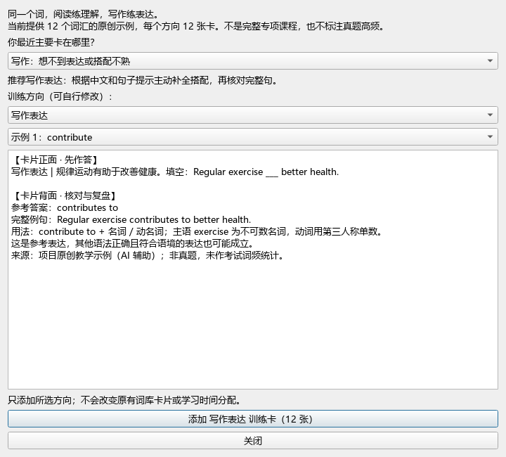

# Task 007：从词汇记忆到阅读与写作训练

日期：2026-09-27。按用户讨论后的方向，先增强学习内容推荐，再推进动态时间分配。

## 本次功能

在助手主窗口点击“阅读语境 / 写作表达训练”：

1. 选择自己确认的困难。阅读生词 / 熟词僻义推荐阅读语境；写作表达 / 搭配困难推荐写作表达。
2. 长难句、定位、时间不足、语法、篇章结构等问题给出对应练习建议，不推断多背词即可解决。用户可自行选择辅助训练方向。
3. 预览每张卡片的正反面，点击添加所选方向。
4. 在 Anki 的 `CET 备考::专项训练::阅读语境` 或 `CET 备考::专项训练::写作表达` 中学习。

示例包包含 12 个词：contribute、address、account、access、benefit、adapt、maintain、significant、promote、reduce、approach、essential。每个方向 12 张卡，可分别导入，共 24 张。没有为 14160 条基础词表自动批量生成例句。

阅读卡通过句子辨析语境义；写作卡通过中文提示与填空练主动表达，背面提供参考答案、完整句和搭配解释。相同词在两种模式有不同任务，分别使用独立牌组与笔记类型。同方向重复添加跳过已有卡，原有词库及复习调度不变。

## 内容来源与边界

所有示例句、填空和说明由本项目 AI 辅助编写，不摘录商业词典或真题。卡片明确标注“非真题，未作考试词频统计”。本轮检查了句子与答案对应、词形、搭配及说明；未经过外部教师审定。不将示例包标为真题高频词库或完整课程。

例如 contribute 的阅读卡练习语境中的“促成、导致”；写作卡要求填入 contributes to，并解释主谓一致及 to 的介词用法。写作背面说明答案为参考表达，不把所有同义表达判错。

当前推荐来自用户选择，不自动根据考试分数、练习正确率或 Anki 按键判断能力。困难选择暂不持久保存，也未接入练习历史趋势，不能称为已经完成动态反馈闭环。此前练习记录继续正常使用。

## 验证

- 52 项单元测试通过，新增困难分流、24 张内容结构、填空答案不泄露、查重保护、无效模式拒绝等检查。
- 真实 Anki 26.9.3 后端临时集合：两方向各 12 张、重复导入不增加、正反面可生成、新卡状态正常、整批一次撤销成功。可复用脚本 `tests/verify_training_backend.py`，结果见 [JSON](training-backend-verification.json)。
- 真实 Qt 离屏：困难选择更新推荐方向、允许手动覆盖、12 个示例可选择、预览切换、处理中控件禁用通过。下图为临时离屏窗口，非桌面人工验收截图。
- 编译检查及 Git 空白检查通过。个人账户未插入测试卡；新版入口由用户按需添加训练包。

## 下一步

将用户确认的困难与具体练习关联保存，再按同类练习的反馈调整内容推荐。扩充例句前先建立更完善的内容审核；使用“真题高频”标签前需要可追溯语料与统计依据。
