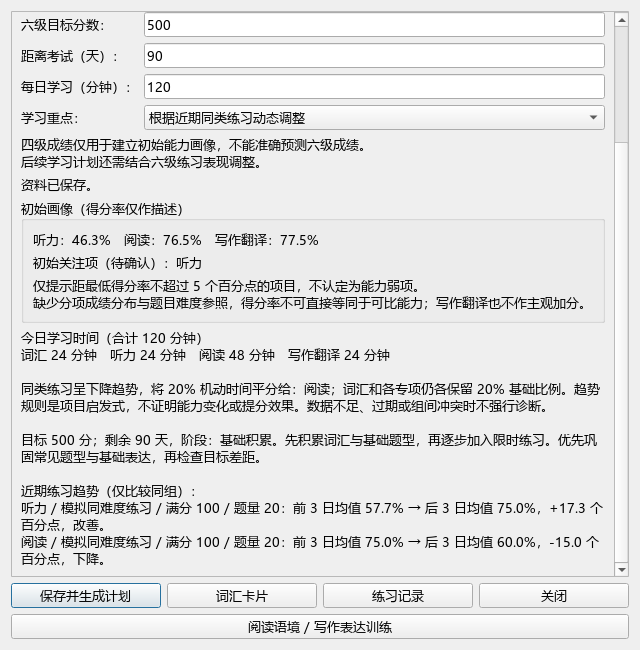

# Task 008：动态学习计划（原 Phase 6）

日期：2026-09-27。

## 操作流程

1. 在“练习记录”填写实际日期、专项、用时及成绩；需要趋势分析时填写可比组名称和可选题量。
2. 只有确认为同题型、相近难度、同评分方式时，勾选“纳入趋势”。写作自评分也需要同一评分标准，不能与客观题分数混比。
3. 返回助手，学习重点选择“根据近期同类练习动态调整”，点击“保存并生成计划”。
4. 查看前后期得分率、变化方向及调整依据。新增练习后重新生成，或下次打开助手时，按最新日期与记录重新计算。

这是用户主动启用的动态模式。均衡、手动重点和初始关注项模式仍保留，不会被后台自动覆盖。关闭练习窗口时提醒重新生成，不覆盖主窗口未保存的输入。

## 可解释规则

- 最近 28 天，包括今天。只处理已确认可比、已填写成绩的听力 / 阅读 / 写作翻译记录。
- 按“专项 + 可比组名称 + 满分 + 题量”分组。题量留空只与留空的同组记录比较。题型、难度可比性仍依赖用户确认，不由软件自动证明。
- 每组至少 6 个不同练习日。取最新 6 日，先求每日得分率平均值，再比较前 3 日和后 3 日的平均值；同一天反复练习不能凑足 6 天。
- 变化达到 5 个百分点才标为改善或下降，其余为变化较小。这是产品启发式阈值，不是统计显著性检验。
- 同一专项存在多个样本足够的组时，只有这些组全部下降才增加该专项比例；组间方向不一致时提示检查，不作单边推断。
- 词汇、听力、阅读、写作翻译各保留 20% 基础比例，剩余 20% 平分给存在一致下降证据的专项。没有这种证据则回到均衡分配。改善不代表已经掌握。
- 最大余数法分配整数分钟；总时间严格等于用户预算。极短预算可能使个别专项分得 0 分钟。
- 不横向比较不同专项的绝对得分率，不预测六级总分，不改 FSRS。

## 兼容与存储

新增练习字段 `comparison_group`、`comparable`、`questions`。已有记录缺少它们时默认空组、不纳入趋势、题量未填，继续正常展示。未知历史记录仍保留。资料的 `study_focus` 新增 `feedback`。

不持久化可能过期的计算结果，保存模式和原始练习记录，下次重新计算。旧插件不认识 feedback 模式，回退前请备份个人资料。

## 验证

61 项单元测试通过。新增 9 项测试覆盖趋势方向、听力改善 / 阅读下降、未确认与无成绩记录、28 日范围、不同日期、满分 / 题量 / 组名隔离、冲突、5 点边界、1～1440 分钟守恒、重复日权重、输入顺序确定性、旧记录兼容和校验。

Anki 自带 Qt 离屏端到端验证通过：可比练习保存 → 读取趋势 → 动态模式保存 → 重新打开仍显示正确计划。个人账户未写入模拟练习。窗口布局已检查，证据见下图；不是桌面人工点击验收。

| 模拟阶段 | 词汇 | 听力 | 阅读 | 写作翻译 |
| --- | ---: | ---: | ---: | ---: |
| 早期：听力下降、阅读稳定 | 24 | 48 | 24 | 24 |
| 后期：听力改善、阅读下降 | 24 | 24 | 48 | 24 |

[实际运行输出](feedback-verification.json)

## 当前边界

趋势用于安排练习关注度，不证明能力变化或因果提分。未提供自动难度校准、历史记录编辑、AI 学习顾问。阅读 / 写作训练卡仍按用户确认的具体困难选择，暂不从趋势自动判定困难原因。
