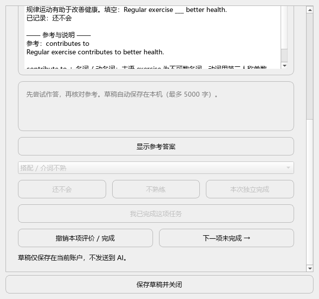

# 0.1.3 独立测试与体验修复（2026-09-30）

## 流程与发现

1. 打开任务、输入草稿、切题：独立 agent 在真实 Qt 隔离数据中注入写盘失败，确认选择回退且输入保留。使用窗口关闭按钮也不会丢失未保存草稿。
2. 评价、撤销、跨日：独立 agent 实测重复评分不覆盖、撤销保留草稿、跨日拒绝旧日评价但草稿可保存。未触碰用户 Anki 集合。
3. 空任务页：agent 发现仍允许输入却不会保存。已禁用无任务输入框，并加入正式 Qt 回归。
4. 小屏：本轮修复前截图显示窗口约 889 像素高。改为内容滚动、关闭按钮常驻，600px 高度实测可滚动到最后操作。
5. 键盘与状态：关闭按钮明确“保存草稿并关闭”；草稿状态随题目更新；禁用隐式默认按钮。主 agent 用真实 Qt 键盘事件确认列表/错因框按 Enter 不会完成任务、评分或关闭。

## 截图

修复前：

修复后小屏滚动至操作区：

## 验证与限制

89 项单元测试通过。正式 verify_daily_ui.py 新增空任务、写盘失败、关闭保护、小屏底部可见、Enter 不误提交测试并通过。0.1.3 包通过本机 Anki 清单解析和解包词库校验。

独立 agent 第一轮反馈已用于修复，第二轮因使用额度耗尽停止，后续检查由主 agent 完成。以上属于真实 Qt 隔离交互和截图验收，不是用户桌面 Anki 全流程实测；未验证读屏器、全部系统缩放或全键盘无障碍。AI 真实服务商联调仍待用户配置。
